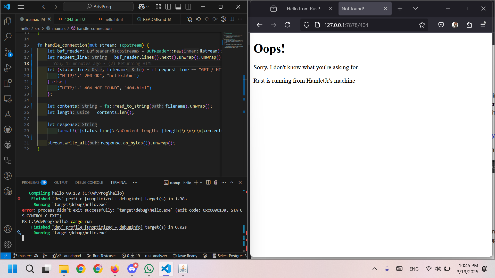

# Module 6
**Nama:**   Joshua Montolalu<br>
**NPM:**    2306275746<br>
**Kelas:**  Pengjut A<br>

## Commit 1 Reflection Notes
Saat ini, isi dari fungsi `handle_connection()` adalah sebagai berikut:
```rs
fn handle_connection(mut stream: TcpStream) {
    let buf_reader = BufReader::new(&mut stream);
    let http_request: Vec<_> = buf_reader
        .lines()
        .map(|result| result.unwrap())
        .take_while(|line| !line.is_empty())
        .collect();
    println!("Request: {:#?}", http_request);
}
```
Fungsi ini menerima 1 argumen yaitu `TcpStream`, sebuah *stream* yang mengandung data untuk protokol TCP. Dalam kasus ini, *stream* tersebut akan berisi data yang diterima server kita, yaitu request dari *client*. Pertama, fungsi `handle_connection` membuat sebuah `BufReader` baru (*buffer*) untuk membaca isi dari `TcpStream`. Kemudian, fungsi ini mengambil *iterator* dari `buffer` dengan *method* `.lines()` yang akan memisahkan data per baris baru (`\n`). Untuk mendapatkan setiap data *string* tersebut, kita menggunakan `.map()` untuk melakukan `.unwrap()` pada setiap baris tersebut (yang berupa tipe `Result<String, std::io::Error>`). 

*Method* `.unwrap()` akan mengembalikan string jika hasilnya valid, atau membuat program kita *panic* (sama halnya dengan *exception* dalam Java) jika ada masalah dalam membaca data. Method `.take_while(|line| !line.is_empty())` memastikan bahwa *iterator* akan terus dipanggil sampai predikat bernilai *false*, yaitu ketika baris sudah kosong. Terakhir, method `.collect()` mengubah hasil *iterator* menjadi sebuah *collection*, yaitu `Vec<_>`. Hasil ini kemudian akan di-*print* ke terminal, sehingga kita mendapatkan hasilnya, yaitu data dari protokol TCP yang diterima oleh server kita.

## Commit 2 Reflection Notes

Berikut adalah hasil tangkapan layar untuk *commit* ke-2.

Saat ini, isi dari fungsi `handle_connection()` adalah:
```rs
fn handle_connection(mut stream: TcpStream) {
    let buf_reader = BufReader::new(&mut stream);
    let http_request: Vec<_> = buf_reader
        .lines()
        .map(|result| result.unwrap())
        .take_while(|line| !line.is_empty())
        .collect();

    let status_line = "HTTP/1.1 200 OK";
    let contents = fs::read_to_string("hello.html").unwrap();
    let length = contents.len();

    let response =
        format!("{status_line}\r\nContent-Length: {length}\r\n\r\n{contents}");
        
    stream.write_all(response.as_bytes()).unwrap();
}
```
Baris-baris di atas masih sama dengan sebelumnya, tetapi sekarang ada baris-baris baru di bawah. Yang pertama, kita membaut variabel baru yaitu `status_line` yang berisi baris *status* untuk response HTTP. Kemudian, terdapat `contents`, yaitu variabel yang berisi isi dari response HTTP kita, yaitu file `hello.html`. File tersebut akan di-*parse* ke *string* menggunakan `fs::read_to_string()` dan di-*unwrap* lagi. Terakhir, panjang dari *string* tersebut akan dihitung dan disimpan dalam `length`. Ini akan berguna nanti untuk baris terakhir, yaitu `response`, yaitu HTTP response kita. Kita menggunakan *macro* `format!()` dan menaruh variabel `status_line` untuk *status response* HTTP kita, kemudian informasi `Content-Length` diisi dengan `length`, yaitu panjang dari *string* yang menjadi isi *response* kita, dan terakhir kita memasukkan isi *response* kita, yaitu *file* HTML yang sudah diubah menjadi *string*. *Response* ini akan ditulis ke `TcpStream` dan akhirnya diterima oleh *browser* kita.

## Commit 3 Reflection Notes

Berikut adalah hasil tangkapan layar untuk *commit* ke-3.

Jika dilihat dari fungsi `handle_connection()` sekarang, kita sedang membedakan antara *response* dengan melihat baris pertama dari *request*, yaitu *request line*, untuk memastikan bahwa *request* yang diterima adalah *request* GET ke endpoint `/`. Jika terdapat *request* lain, misalnya *request* POST atau *request* GET tapi ke *endpoint* lain, *request line* akan berbeda sehingga akan masuk ke *else block*.

Kemudian, untuk alasan mengapa *refactoring* perlu dilakukan, kita dapat melihat perbedaan antara kode lama dan kode baru:

**Kode sebelum *refactoring***
```rs
if request_line == "GET / HTTP/1.1" {
    let status_line = "HTTP/1.1 200 OK";
    let contents = fs::read_to_string("hello.html").unwrap();
    let length = contents.len();

    let response = format!(
        "{status_line}\r\nContent-Length: {length}\r\n\r\n{contents}"
    );

    stream.write_all(response.as_bytes()).unwrap();
} else {
    let status_line = "HTTP/1.1 404 NOT FOUND";
    let contents = fs::read_to_string("404.html").unwrap();
    let length = contents.len();

    let response = format!(
        "{status_line}\r\nContent-Length: {length}\r\n\r\n{contents}"
    );

    stream.write_all(response.as_bytes()).unwrap();
}
```

**Kode setelah *refactoring***
```rs
let (status_line, filename) = if request_line == "GET / HTTP/1.1" {
    ("HTTP/1.1 200 OK", "hello.html")
} else {
    ("HTTP/1.1 404 NOT FOUND", "404.html")
};

let contents = fs::read_to_string(filename).unwrap();
let length = contents.len();

let response =
    format!("{status_line}\r\nContent-Length: {length}\r\n\r\n{contents}");

stream.write_all(response.as_bytes()).unwrap();
```
Dapat dilihat bahwa pada kode yang baru, perbedaan antara kedua cabang lebih jelas dengan melakukan ekstraksi variabel `status_line` dan `filename` yang didefinisikan secara *inline*. Selain itu, kode sudah lebih dipadatkan karena duplikasi kode sudah dihilangkan sehingga ke depannya perubahan hanya perlu dilakukan pada kedua variabel tersebut jika ingin mengubah alur jalannya program; sisanya tidak perlu diubah, seperti variabel `contents`, `length`, dan `response`.

## Commit 4 Reflection Notes
Jika diperhatikan fungsi `handle_connection()` yang baru:
```rs
let (status_line, filename) = match &request_line[..] {
    "GET / HTTP/1.1" => ("HTTP/1.1 200 OK", "hello.html"),
    "GET /sleep HTTP/1.1" => {
        thread::sleep(Duration::from_secs(10));
        ("HTTP/1.1 200 OK", "hello.html")
    }
    _ => ("HTTP/1.1 404 NOT FOUND", "404.html"),
};
```
Endpoint `/sleep` akan membuat *thread* "tidur" selama 10 detik. Ini mensimulasikan *thread* yang sedang sibuk mengerjakan suatu *request*. Jika ternyata ada pengguna lain yang ingin mengakses aplikasi web kita, mereka terpaksa menunggu karena server kita hanya menggunakan satu *thread* sehingga jika *thread* tersebut sedang sibuk, semua *request* lain tidak dapat dilayani dan harus menunggu sampai *thread* tersebut selesai memproses *request*-nya.

## Commit 5 Reflection Notes
Pertama, `ThreadPool` akan dibuat dengan method `new()` dan membuat sebuah *sender* dan *receiver* yang akan digunakan untuk komunikasi dengan *thread*. Kemudian, ThreadPool akan push `Worker` baru sebanyak `size` ke dalam `Vector`. Setiap `Worker` akan looping terus dan menunggu sampai mendapatkan `Job`.

Ketika ada request baru yang datang ke server kita, `main.rs` akan menjalankan `pool.execute()`, di mana `ThreadPool` akan mengirim sebuah `Job` baru yang berisi fungsi yang ingin dijalankan (`handle_connection()`). Salah satu `Worker` kemudian akan mendapatkan `Job` tersebut lewat *channel* komunikasi asinkronus (menggunakan *mutex lock* agar hanya satu *thread* yang dapat mengakses dan mengambilnya), dan akan mengeksekusi fungsi yang terkandung. Setelah *thread* selesai menjalankannya, *thread* akan kembali me-loop dan menunggu untuk `Job` baru dari `ThreadPool`.